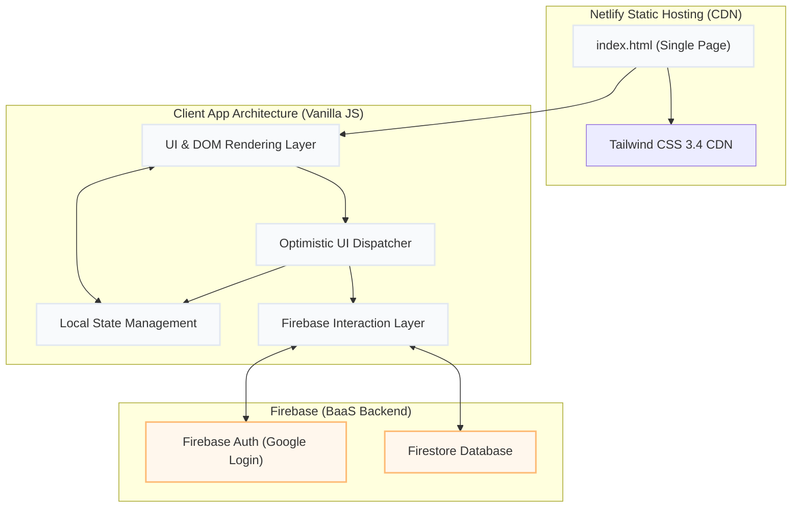
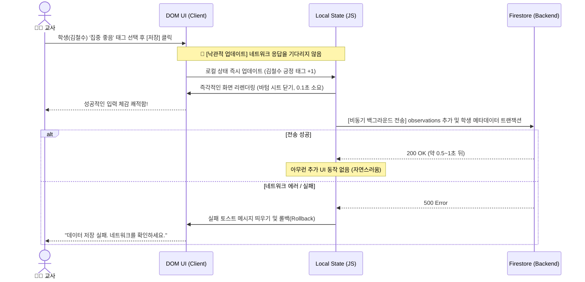
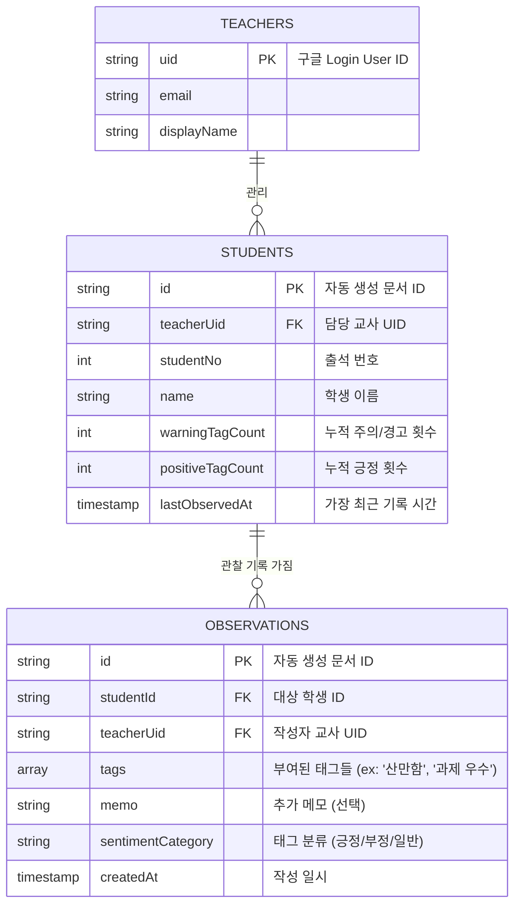

# 학급 관찰 일지 시스템: 소프트웨어 아키텍처 (Software Architecture)

본 문서는 프론트엔드 프레임워크(React, Vue 등) 없이 **순수 Vanilla JS 단일 파일(`index.html`)** 기반으로 구동되는 본 시스템의 기술적 구조와 데이터 흐름을 정의합니다. 극한의 성능과 단일 파일 유지보수성을 동시에 잡기 위해 논리적 계층(Layer)을 명확히 분리합니다.

## 1. 시스템 컴포넌트 아키텍처 (System Component Architecture)

서버 렌더링이나 복잡한 빌드 파이프라인 없이, Netlify 정적 호스팅을 통해 배포된 클라이언트가 Firebase 백엔드와 직접 통신하는 Serverless/BaaS 아키텍처입니다.



## 2. 단일 파일 내부 논리적 구획 (Mono-File Structure)

`index.html` 파일이 거대해지는 것을 막고 유지보수를 가능하게 하기 위해, 스크립트 영역을 다음과 같이 엄격하게 분리하여 구현합니다. 설계 패턴은 MVC(Model-View-Controller)를 차용하여 순수 자바스크립트로 전개합니다.

```html
<!-- 1. Head & Settings -->
<head>
  <!-- Tailwind CDN & Config (Stitch Theme) -->
  <!-- Firebase v10 SDK CDN -->
</head>

<!-- 2. UI Markup (View) -->
<body>
  <div id="login-screen">...</div>
  <div id="app-container" class="hidden">
    <!-- Top Nav / Search -->
    <!-- Student Grid List -->
    <!-- Bottom Sheet (Scenario A) -->
    <!-- Wizard Modal (Scenario B) -->
    <!-- Dashboard Modal (Scenario C) -->
    <!-- FAB & Bottom Nav -->
  </div>

  <!-- 3. Application Logic (Model & Controller) -->
  <script type="module">
    // [Section 1] CONFIG & INIT
    // Firebase 초기화 및 Auth 싱글톤 객체 할당 로직

    // [Section 2] GLOBAL STATE
    // let currentUser = null;
    // let studentsData = [];
    // 로컬 메모리 캐싱 변수들

    // [Section 3] DOM ELEMENTS
    // const $qs = querySelector 로 DOM 노드들 미리 바인딩

    // [Section 4] FIREBASE SERVICES (Model)
    // async fetchStudents(), async saveObservation(doc)
    // 트랜잭션 처리(warningTagCount increment) 담당

    // [Section 5] UI CONTROLLERS & RENDERING (View)
    // renderStudentList(), showBottomSheet(studentId), closeModals()

    // [Section 6] EVENT ATTACHMENT (Controller)
    // '저장' 버튼 클릭 등 이벤트 리스너 통합 바인딩 및 낙관적 UI(Optimistic UI) 처리
  </script>
</body>
```

## 3. 낙관적 UI 상태 흐름도 (Optimistic UI State Flow)

Netlify 배포 환경에서 Firebase 리전이 해외일 경우 핑(Ping)이 증가하는 문제를 해결하기 위해, 모든 쓰기 요청(Write Request)은 **UI 선 반영 후 DB 비동기 처리** 로직을 따릅니다.



## 4. 데이터베이스 및 역정규화 스키마 (Denormalized Data Schema)

NoSQL인 Firestore 특성에 맞춰, 클라이언트에서 필터 작업이나 복잡한 쿼리를 방지하고 속도를 높이기 위해 서버 사이드에서 데이터를 미리 가공해 두는 역정규화(Denormalization) 구조입니다.



* **역정규화 동기화 핵심**: 교사가 새로운 `OBSERVATIONS` 문서를 생성할 때, Firestore의 Transaction 기능을 활용하여 `STUDENTS` 문서에 위치한 `warningTagCount`, `positiveTagCount`, `lastObservedAt` 필드를 한 번의 원자적 처리(Atomic Operation)로 업데이트합니다. 이로 인해 브라우저에서는 오직 `STUDENTS` 리스트만 가져와도 배지 UI(누적 횟수) 표시가 즉각적으로 가능합니다.
